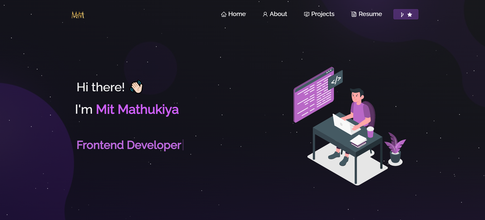

<h2 align="center">
  Portfolio Website - v1.0.0 
  
</h2>

  

 

<h3 align="center">
    🔹
    <a href="https://github.com/beebus/Portfolio/Mitpatel13">Report Bug</a> &nbsp; &nbsp;
    🔹
    <a href="https://github.com/beebus/Portfolio/Mitpatel13">Request Feature</a>
</h3>

Welcome to my portfolio website, <a href="https://michaelbeebower.com" target="_blank">michaelbeebower.com</a>, where I can showcase my software development projects, tell you more about me, and what I am looking for. Last but not least, this is where you can take a look at my resume, my LinkedIn and other profiles, and ways to contact me. 

## Built With

- React.js
- Node.js
- Express.js
- CSS
- Vercel

You can fork this repo to modify and make changes of your own.  

## Features

**📖 Multi-Page Layout**

**🎨 Styled with React-Bootstrap and CSS with easy to customize colors**

**📱 Fully Responsive**

## Getting Started

Clone this repository from GitHub. You will need `node.js` and `git` installed globally on your local computer.

## 🛠 Installation and Setup Instructions

1. Installation: `npm install`

2. In the project directory, you can run: `npm start`

Runs the app in the development mode.\
Open [http://localhost:3000](http://localhost:3000) to view it in the browser.
The page will reload if you make edits.

## Usage Instructions

Open the project folder and Navigate to `/src/components/`.  
You will find all the components used and you can edit your information accordingly.

### Show your support

Give a ⭐ if you like this website!
